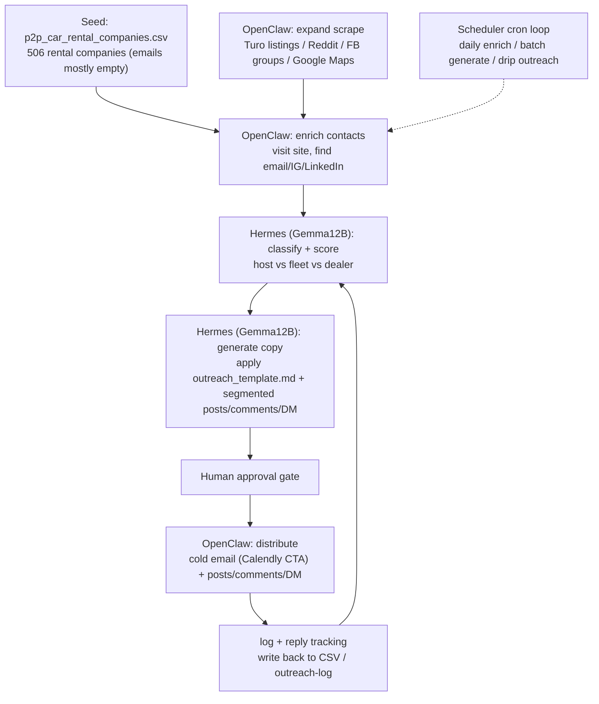

# PLAN: SaaS Marketing & Monetization GTM / SaaS 营销变现策略

**Status:** Draft
**Created:** 2026-06-26
**Scope:** Productize `autopilotee-cars` (web) + `autopiloteeFlutter` (mobile) + `backend-autopilotee-cars` as a white-label rental SaaS sold under **carsharingwhitelabel.com**, and run an OpenClaw + Hermes automated promotion pipeline.
**Brand:** carsharingwhitelabel.com
**Booking CTA:** https://calendly.com/jidosoju/30min

> Bilingual doc (English + 中文). This is a marketing/GTM planning artifact, not an engineering spec. Engineering productization gaps (dynamic multi-tenancy, billing) are called out but tracked separately.

---

## 0. Existing marketing assets (already live) / 现有营销资产(已就绪)

This is **not** a from-scratch effort. Real, reusable assets already exist in this repo (`autopilotee-advertising`) and are the **single source of truth** for campaigns and automation.

不是从零开始——本仓库 `autopilotee-advertising` 里已有真实可复用资产,作为**唯一来源**:

| Asset | Path | Notes |
|-------|------|-------|
| Brand + landing page | `www.carsharingwhitelabel.com` | SaaS public brand, primary domain |
| Booking link | `https://calendly.com/jidosoju/30min` | Demo CTA already used in cold email |
| Lead list | `emails/p2p_car_rental_companies.csv` | **506 rows** of rental companies (Name/Website/Phone/Email/Location/Category/Description). **Email column mostly empty** -> first automation task is enrichment, not re-scraping |
| Cold-email template | `emails/outreach_template.md` | Subject "A new revenue stream for [Company] (no tech build required)" + value bullets + Calendly CTA |
| Demo videos | `videos/calendar-blocking_compressed.mp4`, `videos/calendar-pricing_compressed.mp4` | Feature demos; cut into shorts / embed on landing / attach to outreach |
| Core one-liner | `promptMessages/messageLogs.txt` | "every feature turo has, we have more. Your own white label car sharing web+mobile app is here - carsharingwhitelabel.com" |

**含义 / Implication:** GTM is at the **execution stage** (brand + landing + videos + leads + template already exist). The job of automation is to **amplify and systematize**, not to build assets from zero.

---

## 1. Product analysis & positioning / 产品分析与定位

The product combines a **P2P marketplace (Turo-style) AND traditional location-based fleet rental (Hertz-style)** in one system — web (`autopilotee-cars`) + native app (`autopiloteeFlutter`).

产品拥有竞品罕见的组合:**P2P 市场(Turo 式)+ 传统按地点连锁租车(Hertz 式)**,二合一。

**Proven white-label multi-tenancy / 已验证的白标多租户:** `autopilotee-cars/src/app/constants/siteConfig.ts` already drives domain-based branding & product type (cars on `autopilotee.com`, sports gear on `instasharings.com`). The same machinery powers a multi-product white-label SaaS.

**Depth already built / 现成深度功能:** Stripe payments, DL verification, protection plans, damage claims (`damage-appraisal-backend`), chat, monthly/daily/hourly rental, earnings dashboard, car swap, admin/dealer roles.

**Core hook (keep the established messaging axis) / 核心卖点(沿用主轴):**
- **"Every feature Turo has, we have more — your own white-label car-sharing web + mobile app: carsharingwhitelabel.com"** (from `promptMessages/messageLogs.txt`).
- "Launch your own Turo **and** Hertz under your own brand — web + iOS/Android in weeks, no tech build required" (aligned with the cold-email template).
- Escape Turo platform fees, own your brand and repeat customers, or start a traditional storefront rental company.

**Positioning one-liner / 定位一句话:** **"Rental Business in a Box" — carsharingwhitelabel.com white-label rental SaaS** (P2P marketplace + traditional storefront, combined).

---

## 2. SaaS packaging & pricing / SaaS 打包与定价

**Tiers / 套餐分层:**
- **Starter** — single city / single-location fleet, daily + hourly rental, basic branding, shared app (powered-by). Monthly fee + small transaction take rate.
- **Growth** — multi-location + P2P marketplace, custom domain, protection plans, earnings dashboard.
- **Enterprise / White-label** — own App Store listing (dedicated Flutter build), full custom branding, dedicated support, SLA. One-time setup fee + higher monthly.

**Revenue model / 收入模型:** Subscription (Stripe Billing) + optional GMV take rate + setup fee + add-on modules (AI damage appraisal, DL verification, SMS/email, custom app).

**Pre-monetization productization gaps (track separately) / 变现前的产品化缺口(单独立项):**
`siteConfig.ts` is currently a **hardcoded map**. To become a true self-serve SaaS it needs:
1. DB-driven dynamic tenant config.
2. Self-serve onboarding wizard.
3. Per-tenant data isolation.
4. Subscription billing.

Marketing does **not** wait on this — start with a **concierge MVP** (manually provision each tenant). The engineering work is a separate initiative and must not block promotion.

---

## 3. ICP & channels / 理想客户与渠道

**ICP (generic white-label, both equally) / 理想客户(通用白标,两者并重):**
- Existing Turo hosts / fleet owners (want to escape platform fees, build brand + repeat customers).
- Entrepreneurs starting a new rental company (traditional storefront + P2P).
- Extension: dealerships (test-drive & rent-to-own fleets), specialty rentals (exotic / classic / RV / equipment).

**Channels (mapped to automation capabilities; all funnel to carsharingwhitelabel.com -> Calendly) / 渠道(映射自动化能力,均导向落地页 -> Calendly):**
- **Content / SEO** — blog ("how to start a car rental business", "best Turo alternative for hosts", "build your own rental app"); landing page `carsharingwhitelabel.com`.
- **Communities** — Reddit (r/turo, r/entrepreneur, r/smallbusiness), Facebook Turo host groups, X/Twitter build-in-public, LinkedIn (rental industry / dealerships).
- **Outreach** — cold email to the 506-lead CSV + Turo hosts (reuse `emails/outreach_template.md`) + platform DMs.
- **Directories / launches** — G2, Capterra, AlternativeTo, Product Hunt, "Turo alternatives" listicles.
- **Short video** — cut `videos/calendar-blocking_compressed.mp4` / `videos/calendar-pricing_compressed.mp4` into YouTube / TikTok / Shorts; embed on landing & in outreach.

---

## 4. OpenClaw + Hermes automation pipeline (core) / 自动化推广管线(核心)

Combine **OpenClaw** (browser / computer automation) + **Hermes** (Hermes Claw + Gemma 12B local writing/classification) into a **marketing-robot pipeline**, each stage bound to one capability.

把 OpenClaw(浏览器自动化)+ Hermes(Gemma 12B 本地写作/分类)组成一条**营销机器人流水线**。

**Start from the existing CSV, not a blank scrape / 起点是现有 CSV,不是空库:** `emails/p2p_car_rental_companies.csv` (506 rows, missing emails) -> enrich first, then expand.

**Stage-to-capability mapping / 环节与能力映射:**
- **Lead scraping** — OpenClaw enriches the 506 rows (fill email/contact) in week 1, then expands (Turo hosts, Google Maps "car rental near me", Reddit/FB members).
- **Content generation** — Hermes/Gemma 12B classifies leads and drafts copy from `emails/outreach_template.md` + segmented templates.
- **Browser social** — OpenClaw posts/comments on Reddit, FB groups, X, LinkedIn.
- **Cold email** — OpenClaw/SMTP sends drip campaigns with Calendly CTA.
- **DM outreach** — OpenClaw sends platform DMs (IG/X/LinkedIn).
- **Scheduling** — cron runs daily with rate limits + account warm-up; drip outreach to avoid bans.

**Artifacts / 产出物:** `leads.csv` (expanded + enriched from the existing CSV), `marketing/agent-brief/templates/` (segmented copy incl. `emails/outreach_template.md`), `marketing/agent-brief/tasks/` (daily task queue), `outreach-log/` (reply tracking).

---

## 5. Compliance & anti-ban guardrails (mandatory) / 合规与防封护栏(必须)

Mass automation that ignores ToS and anti-spam law destroys account assets and reputation. Guardrails are not optional.

- **Cold email** — comply with **CAN-SPAM / GDPR / CASL**: real sender identity, physical address, one-click unsubscribe in every message, honor opt-outs within the legal window, only B2B business addresses, no harvested personal emails for EU contacts without basis.
- **Platforms** — respect each platform ToS (Reddit, Facebook, X, LinkedIn, Instagram). Provide value before promotion; never blast identical links.
- **Human approval gate** — automation produces **drafts + suggestions only**; a human reviews/samples before anything is published or sent. No fully-autonomous publishing.
- **Rate limits + account warm-up** — start low volume, ramp gradually; rotate slowly; keep per-platform daily caps (see `marketing/agent-brief/tasks/*.yaml`). Drip, do not blast.
- **Domain/email hygiene** — use a dedicated sending domain/subdomain with SPF, DKIM, DMARC; warm up the sending domain; monitor bounce/complaint rates and pause on spikes.
- **Logging** — every send/post is logged to `outreach-log/` with timestamp, channel, lead id, and result so opt-outs and frequency caps are enforceable.

---

## 6. How to share the planning with Hermes & OpenClaw / 如何把规划投喂给两个 Agent

The doc set includes a **machine-readable Agent Operating Brief** (`marketing/agent-brief/agent-operating-brief.md`) plus structured `tasks/*.yaml` and `templates/*.md`. Because the exact runtime interface of Hermes / OpenClaw varies, use any of three standard delivery patterns:

文档配套**机器可读 Agent Brief** + 结构化任务/文案模板。三种通用投喂方式:

1. **File mount / RAG** — point the agent's working directory or knowledge base at `marketing/planning/saas-marketing-gtm.md` + `marketing/agent-brief/*`. The agent reads them at startup.
2. **System prompt** — paste the Agent Brief's "Role + Mission + Guardrails" block as the system prompt for OpenClaw and Hermes.
3. **Cron task queue** — a scheduler drops `marketing/agent-brief/tasks/*.yaml` jobs; OpenClaw picks up and executes browser/email actions, Hermes generates content, results are written back to `outreach-log/`.

**Recommended split / 推荐分工:**
- **Hermes (Gemma 12B)** = the "brain": classify leads, generate/personalize copy, draft reply suggestions. Feed it `agent-operating-brief.md` + `templates/*.md` as context.
- **OpenClaw** = the "hands": browser actions (scrape, enrich, post, comment, DM, send email). Feed it `agent-operating-brief.md` + `tasks/*.yaml` + the guardrails section.

---

## 7. 30/60/90-day roadmap / 路线图

- **0-30 days** — OpenClaw enriches 506 lead emails -> drip cold email via `emails/outreach_template.md` (Calendly CTA); concierge MVP (manual tenant provisioning) + 1 demo tenant; embed demo videos on carsharingwhitelabel.com; 3 blog posts; Reddit/FB value-post trial (human-reviewed).
- **31-60 days** — expand scraping (Turo hosts / Google Maps), DM outreach, cut demo videos into shorts for YouTube/TikTok, Product Hunt / directory launches, self-serve onboarding wizard prototype, kick off dynamic tenant-config engineering.
- **61-90 days** — Stripe Billing subscriptions, case studies / testimonials, scale automation volume + multi-account rotation.

---

## 8. KPIs / 关键指标

Leads/week, contact-enrichment rate, reply rate, demo bookings (Calendly), trial -> paid conversion, CAC, MRR, and **ban/complaint rate** (guardrail metric — pause automation if it spikes).

---

## Deliverables / 交付物

- `marketing/planning/saas-marketing-gtm.md` — this strategy (bilingual; includes existing-asset inventory).
- `marketing/agent-brief/agent-operating-brief.md` — machine-readable role + guardrails for Hermes/OpenClaw; points at local campaign asset paths.
- `marketing/agent-brief/tasks/*.yaml` — daily task definitions (first task = enrich 506-CSV emails; expand scrape; batch generate; drip outreach) with rate-limit/anti-ban params.
- `marketing/agent-brief/templates/*.md` — segmented copy (reuse `emails/outreach_template.md` + Reddit/FB/X/LinkedIn/DM/blog outline).

**Note / 注:** Engineering productization gaps (dynamic multi-tenancy / billing) are a separate initiative. Marketing starts now via the concierge MVP and does not block on them. This repo remains the single source of truth for campaign assets, task definitions, and agent prompts.
